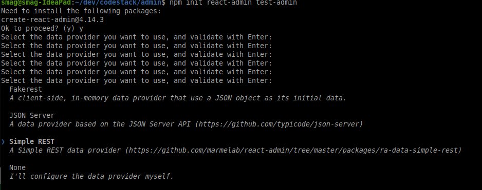
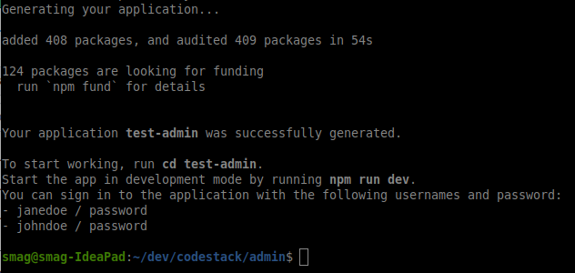
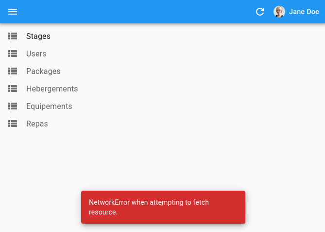
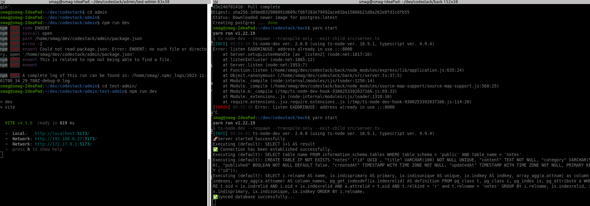
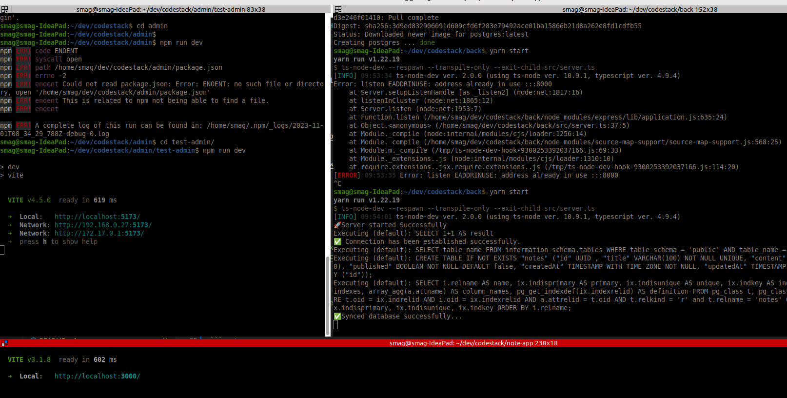

# Project from scratch

```
mkdir codestack
cd codestack
mkdir front admin doc

```


# admin part 
Interface utilisateur pour le gestionnaire, l'administrateur

- using react admin https://marmelab.com/react-admin/Tutorial.html

```
cd admin 
npm init react-admin test-admin
# choose 
# SIMPLE REST
# Hard Coded Local username/password
# Name of a ressource : stage, user, hebergement, package, repas

```







```
cd test-admin
npm run dev

```
-> http://localhost:5173 and login with janedoe/password or johndoe/password




# back part
- inspired from https://codevoweb.com/build-a-crud-api-with-nodejs-and-sequelize/?utm_content=cmp-true

```
git clone https://github.com/wpcodevo/crud-app-sequelize back
yarn install
docker-compose up -d
yarn start
```



<!-- # back part
Backend for reactAdmin with Express & sequelize
- using https://github.com/nicgirault/express-crud-router

cd to '/back' folder
```
npm init -y
npm install express-crud-router


``` -->


# front note-app test part

```
git clone https://github.com/wpcodevo/reactjs-crud-note-app note-app
ce note-app
yarn
yarn dev 

```
-> Local:   http://localhost:3000/





